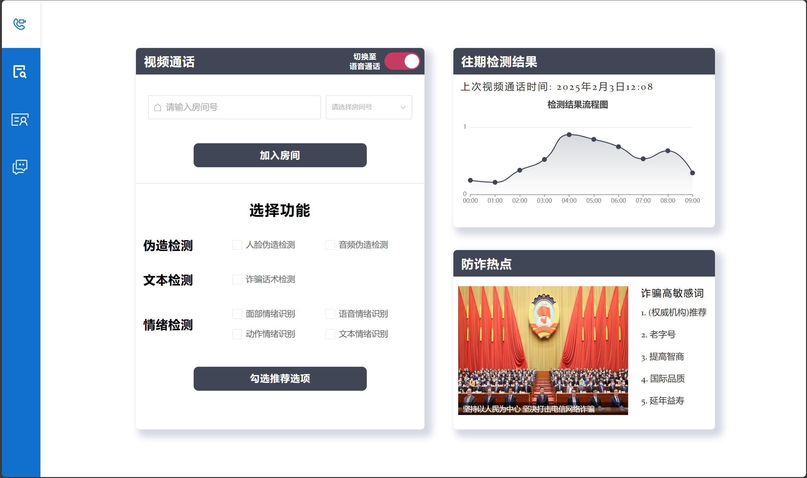
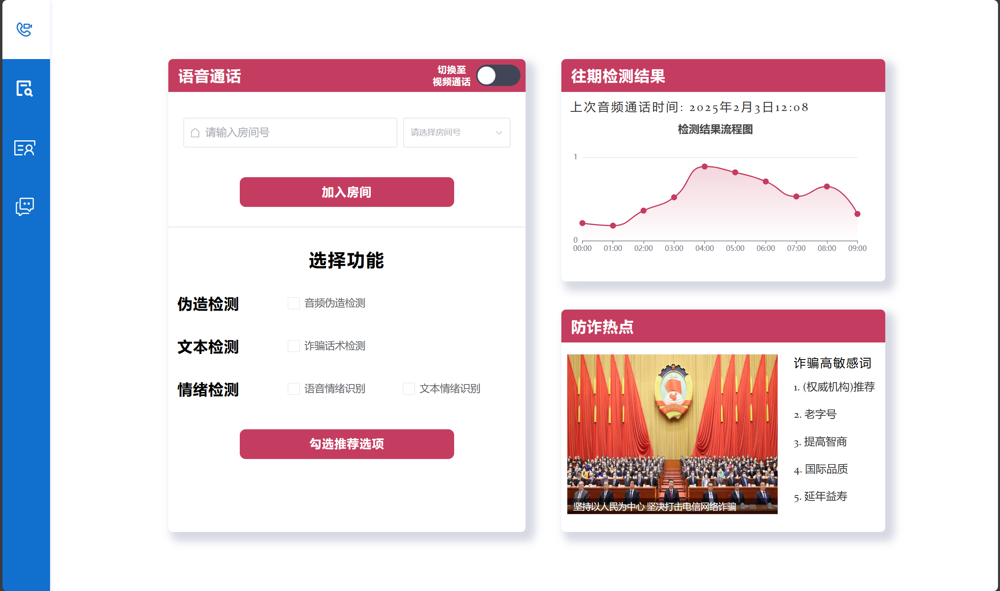
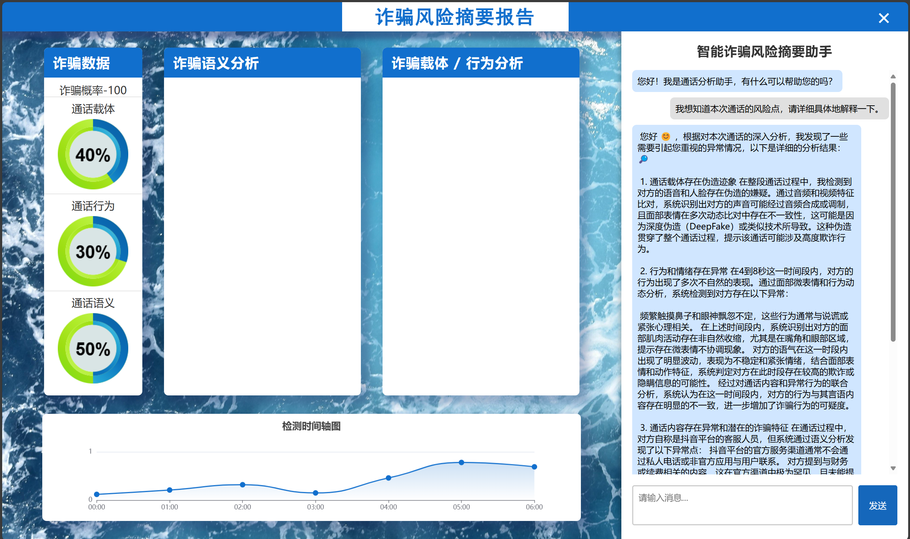
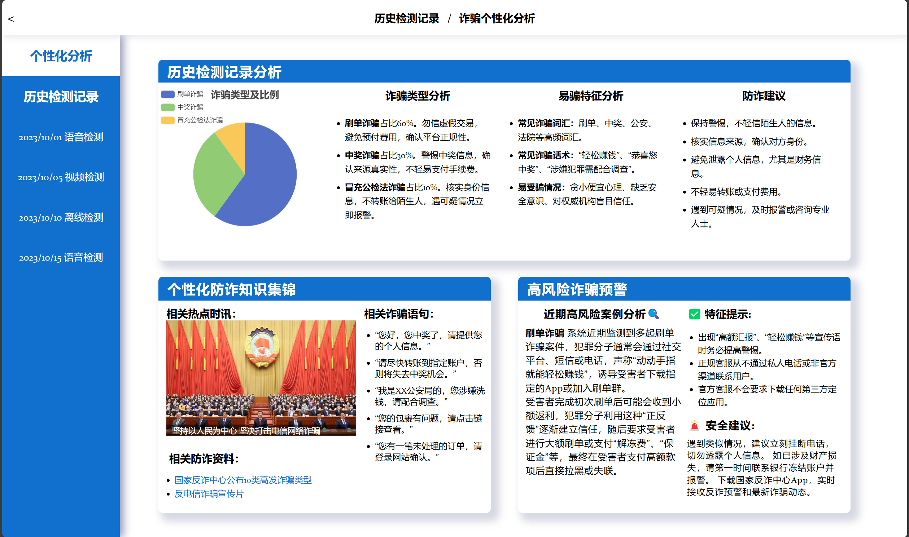

# 这里是挑战杯项目前端部署说明

## 推荐的IDE工具

[VSCode](https://code.visualstudio.com/) + [Volar](https://marketplace.visualstudio.com/items?itemName=Vue.volar) (and disable Vetur).

## 自定义配置

See [Vite Configuration Reference](https://vitejs.dev/config/).

## 下载npm

```sh
npm install
```

### 运行项目

```sh
npm run dev
```


# 一些典型前端界面演示

## 登录界面
> 登录和注册的界面都是这个界面，点击去注册后会有一个fade的动画效果来切换为注册界面
>
> 
>
> 


## 音视频通话界面

> 可以点击滑动开关来将切换至语音通话，同时整个界面的配色会变成红色
>
> 右下角的诈骗热点回来会每隔一段时间切换新闻
>
> 检测结果流程图采用echarts进行效果演示，鼠标hover上去之后会显示信息
>
> 
>
> 


## 诈骗风险摘要报告

> 左边为报告的具体内容，每个module内能通过overflow-y来在文本内容超过height时增加滚动条
>
> 


## 个性化分析

> 这里是能够通过产品往期的检测记录来综合个性化分析用户的诈骗弱点来进行相关知识推送的页面
>
> 
